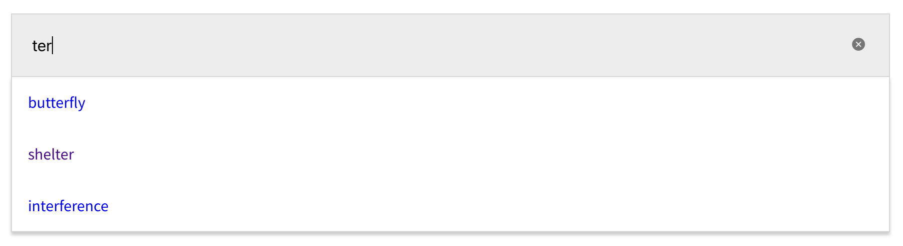

# React Search Suggestions

<div align="center">
  

A React input component with a pluggable data source for auto suggestions on type.

Also includes arrow key navigation through results.

[](https://github.com/adhamu/react-search-suggestions/actions)

</div>

## Prerequisities

- React (obviously)

## Installation

```shell
yarn add @adhamu/react-search-suggestions
```

## Usage

```typescript
import React from 'react'
import SearchSuggestions from '@adhamu/react-search-suggestions'

const suggestions = [
  'polite',
  'fastidious',
  'dull',
  'pudding',
  'mole',
  'angle',
].map(word => ({
  label: word,
  url: `https://www.google.co.uk/search?q=${word}`,
}))

const MyComponent = () => (
  <SearchSuggestions suggestions={suggestions} autoFocus={true} />
)

export default MyComponent
```

## HTML Structure

The markup is very simple

```html
<div>
  <input />
  <ul>
    <li><a href="url">label</a></li>
    <li><a href="url">label</a></li>
    <li><a href="url">label</a></li>
  </ul>
</div>
```

## Props

`suggestions` required an array in the below format:

```typescript
export type Suggestion = {
  label: string
  url: string
}
```

| Prop          | Description                            | Type         | Default     | Required? |
| ------------- | -------------------------------------- | ------------ | ----------- | --------- |
| `suggestions` | Data source for suggestions            | Suggestion[] | n/a         | Y         |
| `className`   | Optional class name to style component | string       | ''          | N         |
| `name`        | Input name                             | string       | 'q'         | N         |
| `placeholder` | Input placeholder                      | string       | 'Search'    | N         |
| `autoFocus`   | Input autoFocus                        | boolean      | `false`     | N         |
| `onChange`    | Input onChange handler                 | function     | `undefined` | N         |

## Styling

As mentioned above, you can provide a `className` to the component. It comes with some very basic styling.

See [index.html](./index.html) from an example.

**Important**: The `:focus` attribute is what powers the active state of a selected element. This is what you want to target to style highlighted search results.

## Arrow Key Navigation

You get this functionality for free and was the main motivation for creating this shared component.
